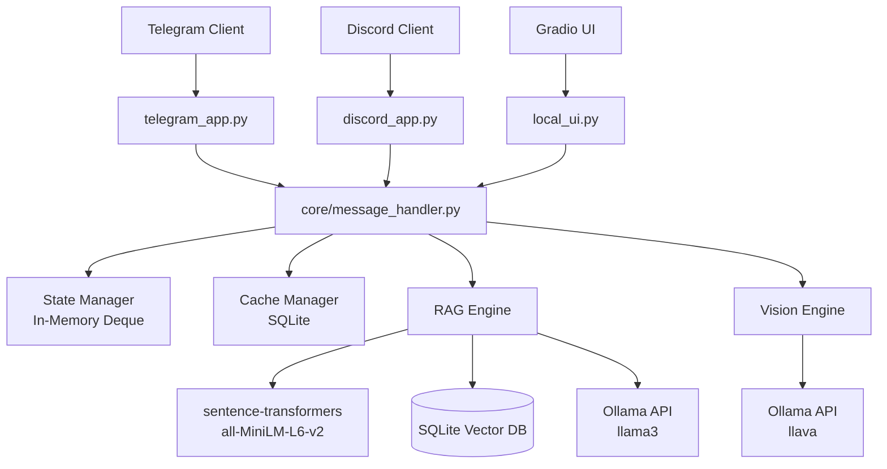
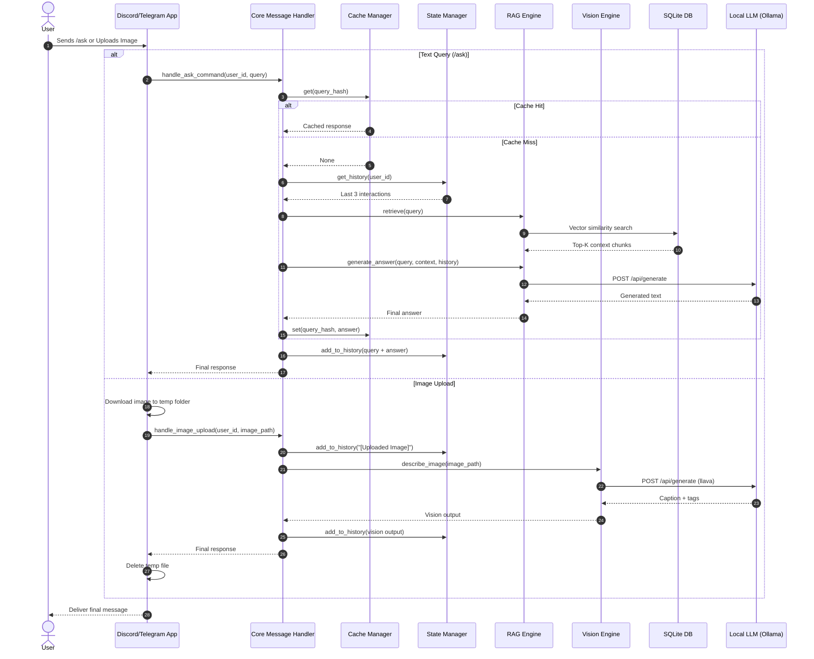

# Janus — Hybrid Multi-Modal Chatbot

A lightweight, multi-modal Generative AI chatbot that runs concurrently on **Telegram** and **Discord**, with an optional **Gradio local debugging UI**.

This system uses a **decoupled architecture**, separating platform integrations from core AI orchestration logic for easier scaling, maintenance, and extension.

---

# Core Capabilities

* **Retrieval-Augmented Generation (RAG)** — Query internal company documents using local embeddings
* **Vision Inference** — Describe and tag uploaded images using local vision models
* **Context Memory** — Maintain short conversational continuity
* **SQLite Caching** — Store query hashes for faster repeated responses
* **Source Snippets** — Show which document was used to generate a response
* **Conversation Summarization** — `/summarize` condenses recent chat or image interactions
* **Platform-Aware Session Management** — User history remains isolated between Telegram and Discord

---

# System Architecture



---

# Data Flow



---

# Tech Stack & Models

## Text Generation

* `llama3` or `phi3` via Ollama
* Used for conversational generation, summarization, and RAG answering

## Vision Model

* `llava` via Ollama
* Used for image captioning and semantic tagging

## Embeddings

* `all-MiniLM-L6-v2` via sentence-transformers
* Used for local semantic retrieval

## Storage

* SQLite for:

  * vector storage
  * response caching
  * metadata

## Frameworks

* `python-telegram-bot`
* `discord.py`
* `gradio`

---

# File Structure

```text
project_root/
├── bots/
│   ├── telegram_app.py      (Handles Telegram API & routing)
│   └── discord_app.py       (Handles Discord API & routing)
├── core/
│   ├── message_handler.py   (The central brain routing to RAG/Vision)
│   ├── rag_engine.py        (SQLite, Embeddings, Ollama Text)
│   ├── vision_engine.py     (Image downloading, Ollama Llava)
│   ├── cache_manager.py     (SQLite caching)
│   ├── state_manager.py     (User history tracking)
│   ├── cache.db             (Response cache database)
│   └── rag.db               (Vector retrieval database)
├── data/                    (Your markdown/text files)
├── main.py                  (Starts both bots concurrently)
├── local_ui.py              (Gradio UI for debugging)
├── requirements.txt
└── testing.md
```

---

# Prerequisites & Installation

## 1. Install Local Models

Make sure you have:

* Python 3.10+
* Ollama installed locally

Pull required models:

```bash
ollama pull llama3
ollama pull llava
```

---

## 2. Install Dependencies

### Option A — Using uv (Recommended)

```bash
uv venv
source .venv/bin/activate
uv pip install -r requirements.txt
```

Windows:

```bash
.venv\Scripts\activate
```

---

### Option B — Using pip

```bash
python -m venv venv
source venv/bin/activate
pip install -r requirements.txt
```

Windows:

```bash
venv\Scripts\activate
```

---

# Configuration & Bot Setup

Create a `.env` file in the project root:

```env
TELEGRAM_TOKEN=your_telegram_bot_token_here
DISCORD_TOKEN=your_discord_bot_token_here
```

⚠️ Never commit `.env` to GitHub.

---

## Generating Tokens

### Telegram

1. Open Telegram and search for **@BotFather**
2. Start a chat and run:

```text
/newbot
```

3. Follow the setup steps to create your bot
4. Copy the generated token
5. Paste it into your `.env` file

---

### Discord

1. Open the **Discord Developer Portal**
2. Create a **New Application**
3. Open the **Bot** tab
4. Generate your bot token
5. Add the token to your `.env` file

Enable the following setting inside **Bot → Privileged Gateway Intents**:

```text
Message Content Intent
```

Without this enabled, the bot cannot read `/ask` commands.

---

#### OAuth2 Setup

Open **OAuth2 → URL Generator**

Under **Scopes**, select:

```text
bot
applications.commands
```

Then under **Bot Permissions**, enable:

```text
View Channels
Send Messages
Read Message History
Attach Files
Embed Links
```

Discord will automatically generate an invite URL.

Open that URL in your browser and add the bot to your server.

--- 

# 🚀 Running the Project

## Start Production Bots

### Using Python

```bash
python main.py
```

### Using uv

```bash
uv run python main.py
```

---

## Start Local Gradio UI

### Using Python

```bash
python local_ui.py
```

### Using uv

```bash
uv run python local_ui.py
```

Access locally at:

```text
http://127.0.0.1:7860
```

---

# 🎬 Demo

## Telegram Demo


---

## Discord Demo


---

## Gradio Local UI


---

# Command Reference

| Command        | Platform           | Description                                                        |
| -------------- | ------------------ | ------------------------------------------------------------------ |
| `/ask <query>` | Telegram + Discord | Queries internal documents using RAG and keeps last 3 interactions |
| `/summarize`   | Telegram + Discord | Summarizes recent conversation history                             |
| Send Image     | Telegram           | Generates caption + 3 semantic tags                                |
| `/image`       | Discord            | Attach image for caption + tags                                    |


# Testing

A complete testing checklist is available in:

```md
testing.md
```

This includes:

* Local Gradio testing
* Telegram bot validation
* Discord bot validation
* Cache verification
* Memory verification
* Vision testing
